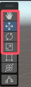

[教程链接](https://www.bilibili.com/video/BV1gQ4y1e7SS?spm_id_from=333.788.videopod.episodes&vd_source=8924ad59b4f62224f165e16aa3d04f00&p=2)

# 5.创建游戏物体

选取、移动、旋转、缩放

# 6.坐标系

有世界坐标和相对坐标  

可以抛弃世界坐标的概念，把“世界”看成没有其它父节点的物体的父节点  

**中心和轴心的区别**

当物体A有子物体B时,选中A,坐标轴在编辑器中出现的位置可能在两个物体的重心,这就是"中心"

切换到"轴心"则坐标轴位置与子物体无关

**关于旋转**

物体经过旋转后，选“局部”和“全局”，坐标轴指向的方向是不同的

当前者被选中，物体旋转时坐标轴会随着旋转；后者则不会。

# 7.对物体的基本操作