[教程链接](https://www.bilibili.com/video/BV1gQ4y1e7SS?spm_id_from=333.788.videopod.episodes&vd_source=8924ad59b4f62224f165e16aa3d04f00&p=2)

# 5.创建游戏物体

物体的表面都是由很多三角形组成的，建模越精细的物体三角形越多

# 6.坐标系

有世界坐标和相对坐标  

可以抛弃世界坐标的概念，把“世界”看成没有其它父节点的物体的父节点  

**中心和轴心的区别**

当物体A有子物体B时,选中A,坐标轴在编辑器中出现的位置可能在两个物体的重心,这就是"中心"

切换到"轴心"则坐标轴位置与子物体无关

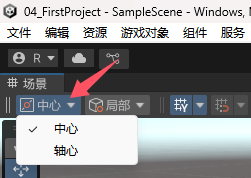

**关于旋转**

物体经过旋转后，选“局部”和“全局”，坐标轴指向的方向是不同的

当前者被选中，物体旋转时坐标轴会随着旋转；后者则不会。  

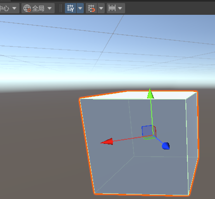

在这两种情况下可以通过鼠标拖动坐标轴以实现物体朝不同方向移动

# 7.对物体的基本操作

按住鼠标右键时可以用`W、A、S、D`移动摄像头

选取、移动、旋转、缩放

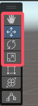

从上往下快捷键依次是`Q、W、E、R、T、Y`

**移动物体**

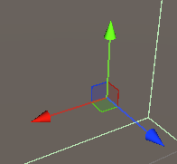

可以选中某个坐标轴(上图中箭头)在一个维度上移动，也可以选中某个面(图中有蓝绿红三个面)，在平面上移动

**旋转物体**

可以绕XYZ三个轴旋转

# 8.导入游戏模型

打开项目文件夹

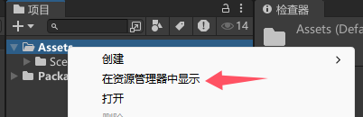

资源文件可以放入对应文件夹 也可以直接拖到unity编辑器中  

`.fbx`文件是最常用的模型文件

**导出包**

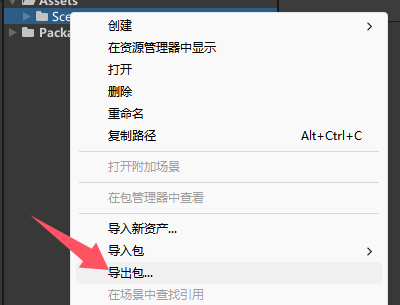

会生成一个`.unitypackage`文件，相当于一个压缩文件，拖到Unity编辑器中可以解压。

演示了**创建和使用材质**

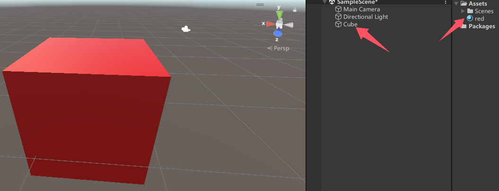

这里将最右边的材质球`red`和立方体`Cube`绑定到一起了

# 9.从商店获取资源

**切换物体形状**(例如正方体换成圆柱体)

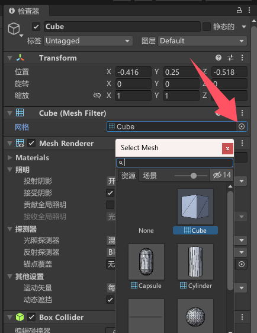

**切换材质**

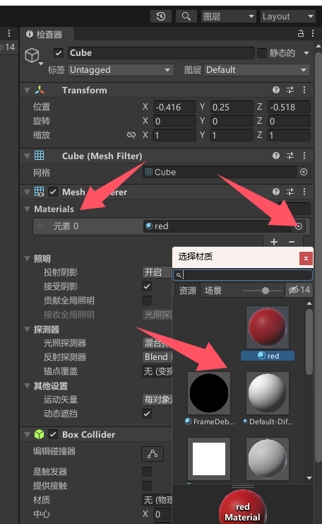

**资源商店**

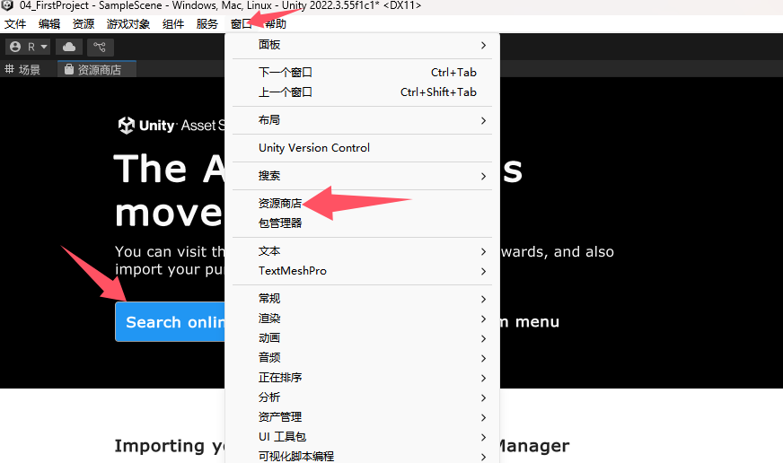

或者直接[打开网页](https://assetstore.unity.com/)，点击搜索按钮进入`/search`网址后，能看到价格筛选，可以选择免费

**查看已拥有的资源**

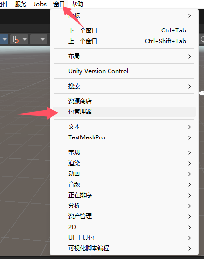

# 10.创建地形

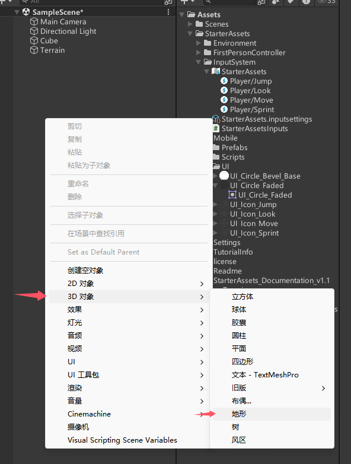

选中地形后 右边会出现五个操作选项  可以修改地形

# 11.为地形化妆

演示了`10.创建地形`最后提到的五个操作选项的其中几个，为地形添加了树木草地等等

# 12.脚本组件

“一个功能对应一个组件”

引擎中各个不同的物体，其实就是空物体加上了各种不同的**组件**  

**创建脚本**

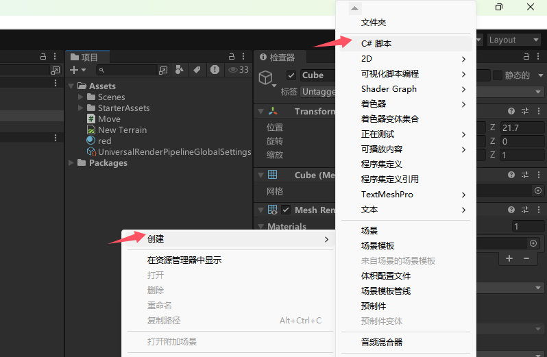

右边这些东西全都是**组件**

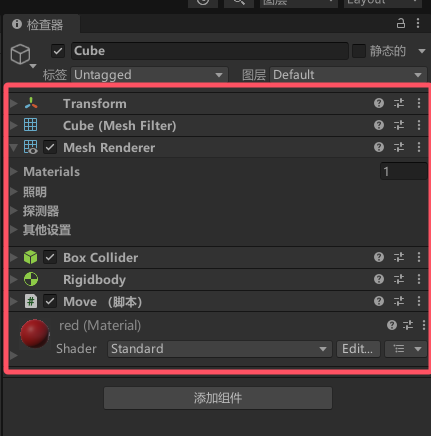

# 13.玩转脚本组件

要添加自定义组件 就 创建C#脚本 然后把脚本拖拽到物体上

# 14.脚本的生命周期

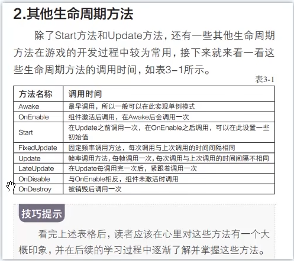

# 15.脚本的执行顺序问题

当一个物体上添加了多个脚本，各脚本都有`Awake`和`Start`方法，执行顺序是：所有脚本的`Awake`方法执行完后再执行所有脚本的`Start`方法

也可以设置脚本的执行顺序

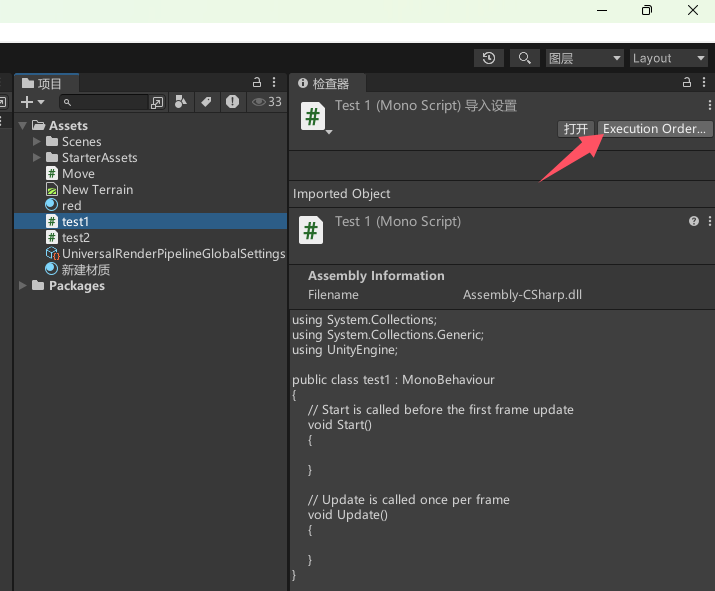

# 16.给游戏物体做标记

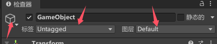

有三类标记  

其中标签可以用来找到物体，或者可以找到物体时查看其标签

图层只有32个值，可以用来分类做碰撞检测或者设置物体在摄像机中是否显示

# 17.向量

# 18.向量的运算及意义
