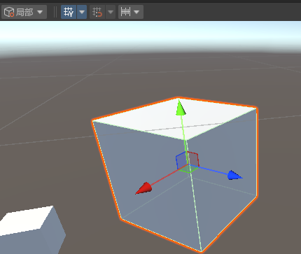
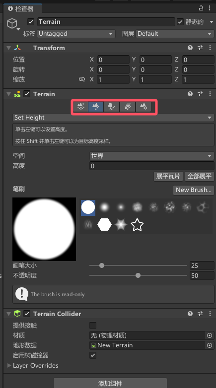

[教程链接](https://www.bilibili.com/video/BV1gQ4y1e7SS?spm_id_from=333.788.videopod.episodes&vd_source=8924ad59b4f62224f165e16aa3d04f00&p=2)

# 5.创建游戏物体

物体的表面都是由很多三角形组成的，建模越精细的物体三角形越多

# 6.坐标系

有世界坐标和相对坐标  

可以抛弃世界坐标的概念，把“世界”看成没有其它父节点的物体的父节点  

**中心和轴心的区别**

当物体A有子物体B时,选中A,坐标轴在编辑器中出现的位置可能在两个物体的重心,这就是"中心"

切换到"轴心"则坐标轴位置与子物体无关


**关于旋转**

物体经过旋转后，选“局部”和“全局”，坐标轴指向的方向是不同的

当前者被选中，物体旋转时坐标轴会随着旋转；后者则不会。  




在这两种情况下可以通过鼠标拖动坐标轴以实现物体朝不同方向移动

# 7.对物体的基本操作

按住鼠标右键时可以用`W、A、S、D`移动摄像头


选取、移动、旋转、缩放


从上往下快捷键依次是`Q、W、E、R、T、Y`

**移动物体**


可以选中某个坐标轴(上图中箭头)在一个维度上移动，也可以选中某个面(图中有蓝绿红三个面)，在平面上移动

**旋转物体**

可以绕XYZ三个轴旋转

# 8.导入游戏模型

打开项目文件夹


资源文件可以放入对应文件夹 也可以直接拖到unity编辑器中  

`.fbx`文件是最常用的模型文件

**导出包**


会生成一个`.unitypackage`文件，相当于一个压缩文件，拖到Unity编辑器中可以解压。


演示了**创建和使用材质**


这里将最右边的材质球`red`和立方体`Cube`绑定到一起了

# 9.从商店获取资源

**切换物体形状**(例如正方体换成圆柱体)


**切换材质**


**资源商店**


或者直接[打开网页](https://assetstore.unity.com/)，点击搜索按钮进入`/search`网址后，能看到价格筛选，可以选择免费

**查看已拥有的资源**


# 10.创建地形


选中地形后 右边会出现五个操作选项  可以修改地形



# 11.为地形化妆

演示了`10.创建地形`最后提到的五个操作选项的其中几个，为地形添加了树木草地等等

# 12.脚本组件

“一个功能对应一个组件”

引擎中各个不同的物体，其实就是空物体加上了各种不同的**组件**  

**创建脚本**


右边这些东西全都是**组件**


# 13.玩转脚本组件

要添加自定义组件 就 创建C#脚本 然后把脚本拖拽到物体上

# 14.脚本的生命周期


# 15.脚本的执行顺序问题

当一个物体上添加了多个脚本，各脚本都有`Awake`和`Start`方法，执行顺序是：所有脚本的`Awake`方法执行完后再执行所有脚本的`Start`方法

也可以设置脚本的执行顺序


# 16.给游戏物体做标记


有三类标记  

其中标签可以用来找到物体，或者可以找到物体时查看其标签

图层只有32个值，可以用来分类做碰撞检测或者设置物体在摄像机中是否显示

# 17.向量

标量：只有大小  

向量：既有大小，也有方向

向量的模：向量的大小（向量除去方向）

单位向量：大小为1的向量

单位化、归一化：把向量转为单位向量的过程

# 18.向量的运算及意义

高中数学

# 19.预制体与变体

引擎中使用的翻译是“预制件”，但是标题使用的词是预制体

## 19.1.创建预制体

预制件：


把左边的`Enemy`物体往右拖拽，就生成对应的`Enemy`预制件文件了。  

修改右边预制件文件左边的物体也会随之改变，修改游戏物体预制件文件则不会改变。  

## 19.2.“选择”按钮

如果左边物体名是蓝色，显然其有一个对应的预制件。如何找到这个预制件呢？

点击右边的”选择“就好了


## 19.3.“打开”按钮

如果点击”打开“或者双击右边的预制体，可以进入修改预制体的界面

## 19.4.“覆盖”按钮

当一个与预制体对应的游戏物体被添加了多个组件时，点击”覆盖“可以把对应的修改覆盖到预制体上

## 19.5.变体

有一个预制体对应的游戏物体时，把游戏物体往右边拖会出现选项”原始预制件“和“预制件变体”


选择“预制件变体”就创建了一个变体  

如果把原始预制件看作`parent`类，那预制件变体就是`child`类，修改变体时变体对应的游戏物体也会随之改变，而原始预制件不会随之改变  

修改原始预制件时变体和变体对应的游戏物体会随之改变

## 19.6.我有一个问题

通常情况下，修改预制体原件时变体会进行同样的变动，但是如果先对变体的某项数值（比如y轴缩放进行了设置），我再设置预制体原件的y轴缩放，此时变体的y轴缩放就不会改变了。它们之间的“联系”似乎被切断了，我要如何重建这个“联系”？

# 20.Vector3的使用

“从这节课开始对脚本当中常用的类和结构体进行讲解”  

> 题外话，我在这里使用`Visual Studio`编写`C#`时没有代码提示，然后在`unity`中点击 编辑->首选项->外部工具 把外部脚本编辑器从VS2017改成VS2022就可以了，因为我隐约记得电脑上的unity选择的VS版本是2022

```C#

//三位向量可以表示一个 向量、坐标、旋转、缩放
Vector3 v = new Vector3(1,1,1);
v = Vector3.zero;   // 0 0 0
v = Vector3.one;    // 1 1 1
v = Vector3.forward;// 0 0 1
v = Vector3.back;   // 0 0 -1
v = Vector3.left;   // -1 0 0
v = Vector3.right;  // 1 0 0
v = Vector3.up;     // 0 1 0
v = Vector3.down;   // 0 -1 0

//可以修改某一维的值
v.x = 0;
v.y = 1;
v.z = 2;
    
//向量之间的计算
//两向量夹角
Vector3 v1 = Vector3.right;
Vector3 v2 = Vector3.forward;
Debug.Log(Vector3.Angle(v1,v2)); //90
//两点之间的距离
Debug.Log(Vector3.Distance(v1,v2)); //根号2
//点乘
Debug.Log(Vector3.Dot(v1,v2)); //0
//叉乘
Debug.Log(Vector3.Cross(v1,v2)); //(0,-1,0)
//插值
Debug.Log(Vector3.Lerp(Vector3.zero,Vector3.one,0.5f));//(0.5,0.5,0.5)
//向量的模
Debug.Log(v1.magnitude);//1
//规范化向量(单位向量)
Debug.Log(Vector3.one.normalized);//(0.58,0.58,0.58)
```

> 由于提到了叉乘，这里说一下右手定则：右手定则用于确定叉乘结果向量的方向，右手四指指向第一个向量，然后向内弯曲至第二个向量，伸直拇指，拇指的方向就是叉乘结果向量的方向

但是，unity的坐标系是左手坐标系，不适用于右手定则而是左手定则，因此确定方向时需要把右手换成左手  

如何区分右手系和左手系？四指指向x轴，向内旋转指向y轴，此时大拇指方向是z轴，如果右手可以做到就是右手系，左手可以做到就是左手系  

叉乘结果向量方向确定了，那长度呢？长度等于两个向量围成的平行四边形面积，即 $||A|| \cdot ||B|| \cdot sin(θ)$  

更多的数学知识就先不关心了 ~~因为我忘光了，再写下去很费时间~~  
