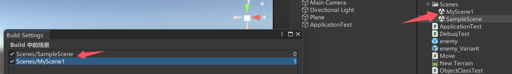

# 21.欧拉角与四元数

unity编辑器中的“旋转”各分量使用值一般情况下是0到360的**欧拉角**来表示


使用**四元数**来表示角度是unity中一种更常用更高效的做法。可能我们不理解四元数，但是可以将欧拉角和四元数进行相互转换  

```C#
//下面这个vector表示物体沿y轴旋转30度  
Vector3 rotate = new Vector3(0, 30, 0);
Quaternion quaternion = Quaternion.identity;
//欧拉角转换为四元数
quaternion = Quaternion.Euler(rotate);
//四元数转为欧拉角
rotate = quaternion.eulerAngles;
//看向一个物体
quaternion = Quaternion.LookRotation(new Vector3(0, 0, 0));//返回需要旋转的角度
```

> 这里有个问题，既然物体可以“看向一个物体”，那么“物体的朝向”是如何定义的？视频中没有讲

# 22.Debug

可以输出到控制台 普通信息、警告、错误

```C#
Debug.Log("test1");
Debug.LogWarning("test2");
Debug.LogError("test3");
```

运行之后可以点击对应按钮显示或隐藏对应类型的信息


除了输出文字到控制台  还可以通过在游戏场景中绘制的方式进行debug

```C#
//绘制一条线
Debug.DrawLine(new Vector3(1,0,0), new Vector3(1, 1, 0));
Debug.DrawLine(new Vector3(1,0,0), new Vector3(1, 1, 0), Color.blue);
//绘制一条射线
Debug.DrawRay(new Vector3(1, 0, 0), new Vector3(1, 1, 0), Color.red);
```

“这些线只有开发人员看得到，真正的游戏场景里是看不到的”  

上面绘制的线段和射线是不一样的：线段的两个参数是两端点，射线的第一个参数是起点，第二个参数以起点为原点，表示方向  


# 23.物体类的使用

如何使用脚本修改物体的状态（位置形状颜色等等...）

有物体`EmptyObject`和对应脚本`ObjectClassTest.cs`


```C#
using System.Collections;
using System.Collections.Generic;
using UnityEngine;

public class ObjecClasstTest : MonoBehaviour
{
    public GameObject Cube;
    //获取预设体
    public GameObject Prefab;
    // Start is called before the first frame update
    void Start()
    {
        GameObject go = this.gameObject; //在这里this可以省略
        //名字
        Debug.Log(go.name);
        //可以直接这样写
        Debug.Log(gameObject.name);
        //标签
        Debug.Log(gameObject.tag);
        //图层
        Debug.Log(gameObject.layer);
        //立方体的名称
        Debug.Log(Cube.name);
        //Cube在场景中是否激活
        Debug.Log(Cube.activeInHierarchy);
        //Cube物体本身的激活状态
        Debug.Log(Cube.activeSelf);
        //获取Fransform组件
        Transform trans = this.transform; //由于每个物体都有一个transform组件，有很简便的获取transform组件的方法，跟gameObject一样
        Debug.Log(transform.position);
        //获取其它组件
        BoxCollider bc = GetComponent<BoxCollider>();

        //获取当前物体的子物体身上的某个组件
        //GetComponentInChildren<CapsuleCollider>(bc);

        //获取当前物体的父物体身上的某个组件
        //GetComponentInChildren<BoxCollider>(bc);

        //添加一个组件
        gameObject.AddComponent<AudioSource>();
        //给Cube添加
        Cube.AddComponent<AudioSource>();
        //通过游戏物体的名称来获取游戏物体
        GameObject test = GameObject.Find("Test");
        //通过游戏标签来获取游戏物体
        test = GameObject.Find("Enemy");
        //设置激活状态
        test.SetActive(true);
        //生成
        GameObject fab = Instantiate(Prefab);
        //销毁
        Destroy(fab)
    }

    // Update is called once per frame
    void Update()
    {
        
    }
}

```

上方代码输出的标签和图层就是上图右上角的标签和图层


这里是否打勾对应物体是否激活，且在场景中非激活状态的物体的所有子物体也是非激活的。若GameObject的勾取消了 则

```C#
Debug.Log(Cube.activeInHierarchy);//输出 false Cube在场景中未激活
Debug.Log(Cube.activeSelf);//输出 true Cube物体本身是激活的
```

上方代码`public GameObject Cube;`中`Cube`变量对应到子物体的方式是在unity中用鼠标拖拽（把下图中的1拖拽到2）


还有别的获取游戏物体的方式

```C#
//通过游戏物体的名称来获取游戏物体
GameObject test = GameObject.Find("Test");
//通过游戏标签来获取游戏物体
test = GameObject.Find("Enemy");
```

> 这里我有一个问题，Find方法的寻找范围？

脚本实现通过预设体创建游戏物体

```C#
public GameObject Prefab;//要在unity中把预设体拖到这个变量上
//生成
GameObject go = Instantiate(Prefab);
//销毁
Destroy(go)
```

# 24.游戏时间的使用

```C#
using System.Collections;
using System.Collections.Generic;
using UnityEngine;

public class TimeTest : MonoBehaviour
{
    double timer = 0;
    // Start is called before the first frame update
    void Start()
    {
        //游戏开始到现在所花的时间
        Debug.Log(Time.time);
        //时间缩放值（设置时间流速？）
        Debug.Log(Time.timeScale);
        //固定时间间隔
        Debug.Log(Time.fixedDeltaTime);

    }

    // Update is called once per frame
    void Update()
    {
        timer += Time.deltaTime;
        //上一帧到这一帧所用的游戏时间
        //Debug.Log(Time.deltaTime);
        if(timer > 3)
        {
            Debug.Log("大于3秒了");
        }
    }
}
```

# 25.Application

C#脚本可能读取一些文件，也可能写入一些文件，从哪里读，写到哪里呢

```C#
using System.Collections;
using System.Collections.Generic;
using UnityEngine;

public class ApplicationTest : MonoBehaviour
{
    // Start is called before the first frame update
    void Start()
    {
        //游戏数据文件夹路径（只读，打包后会被加密压缩）
        Debug.Log(Application.dataPath);
        //持久化文件夹路径（可写）
        Debug.Log(Application.persistentDataPath);
        //streamingAssets（只读，不会加密压缩，可以存放配置文件和其它不需要加密的文件）
        Debug.Log(Application.streamingAssetsPath);
        //缓存路径 存放临时文件
        Debug.Log(Application.temporaryCachePath);
        //控制是否在后台运行
        Debug.Log(Application.runInBackground);
        //打开url
        Application.OpenURL("https://www.baidu.com");
        //退出游戏
        Application.Quit();
    }

    // Update is called once per frame
    void Update()
    {
        
    }
}
```

# 26.场景类

游戏包含若干个场景，场景包含若干个游戏物体，游戏物体包含若干个脚本


之前都是在默认的场景中添加游戏物体、脚本组件，接下来试着创建多个场景，加载新的场景  

之前的默认场景是下图中的`SampleScene`它处于右边的`Scenes`文件夹中，这里已经创建了自己的场景`MyScene1`


选中`SampleScene`后点击左上角的 文件 -> 生成设置 把两个场景拖进来



```C#
using System.Collections;
using System.Collections.Generic;
using UnityEngine;
using UnityEngine.SceneManagement;
public class SceneTest : MonoBehaviour
{
    // Start is called before the first frame update
    void Start()
    {
        //场景类 和 场景管理类

        //使用下标加载场景
        //SceneManager.LoadScene(1);

        //或者用场景名加载场景
        //SceneManager.LoadScene("MyScene1");

        //获取当前场景
        Scene scene = SceneManager.GetActiveScene();
        //场景名称
        Debug.Log(scene.name);
        //场景是否已经加载
        Debug.Log(scene.isLoaded);
        //场景路径
        Debug.Log(scene.path);
        //场景索引
        Debug.Log(scene.buildIndex);
        //所有游戏物体
        GameObject[] gos = scene.GetRootGameObjects();
        Debug.Log(gos.Length);

        //场景管理类
        //创建新场景
        Scene newScene = SceneManager.CreateScene("newScene");
        //已加载场景个数
        Debug.Log(SceneManager.sceneCount);
        //卸载场景
        SceneManager.UnloadSceneAsync(newScene);

        //另一种场景加载的方式
        SceneManager.LoadScene("MyScene1",LoadSceneMode.Single);//加载新的场景，把原本的场景卸载
        SceneManager.LoadScene("MyScene1",LoadSceneMode.Additive);//新的场景和原本的场景同时存在（叠加在一起）
    }

    // Update is called once per frame
    void Update()
    {
        
    }
}
```

# 27.异步加载场景并获取进度

有一些加载数据、加载场景的操作很费时，需要异步执行  

C#可以用多线程实现，unity提供了协程

```C#
using System.Collections;
using System.Collections.Generic;
using UnityEngine;
using UnityEngine.SceneManagement;
public class AsyncTest : MonoBehaviour
{
    AsyncOperation operation;
    // Start is called before the first frame update
    void Start()
    {
        StartCoroutine(loadScene());
    }
    //协程方法用来异步加载场景
    IEnumerator loadScene()
    {
        operation = SceneManager.LoadSceneAsync(1);
        //加载完场景不要自动跳转
        operation.allowSceneActivation = false;

        yield return operation;
    }

    float timer = 0;


    // Update is called once per frame
    void Update()
    {
        //输出加载进度 范围是0到0.9
        Debug.Log(operation.progress);
        timer += Time.deltaTime;
        //到达五秒再跳转
        if(timer > 5)
        {
            operation.allowSceneActivation = true;
        }
    }
}
```

# 28.了解Transform

`Transform`是unity里每个游戏物体都会有的一个组件，它包含位置、旋转、缩放的信息  

`Transform`也记录了物体之间的`parent-child`关系

```C#
//TransformTest.cs
using System.Collections;
using System.Collections.Generic;
using UnityEngine;

public class TransformTest : MonoBehaviour
{
    // Start is called before the first frame update
    void Start()
    {
        /*
        //位置
        Debug.Log(transform.position);//世界位置
        Debug.Log(transform.localPosition);//相对于父物体的位置
        //旋转
        Debug.Log(transform.rotation);//四元数
        Debug.Log(transform.localRotation);
        Debug.Log(transform.eulerAngles);//欧拉角
        Debug.Log(transform.localEulerAngles);
        //缩放
        Debug.Log(transform.localScale);//缩放
        //向量
        Debug.Log(transform.forward);
        Debug.Log(transform.right);
        Debug.Log(transform.up);
        */

        //父子关系
        //获取父物体
        //transform.parent.gameObject
        //子物体个数
        //Debug.Log(transform.childCount);
        //接触与子物体的父子关系
        //transform.DetachChildren();
        //获取子物体
        Transform trans = transform.Find("Child");
        trans = transform.GetChild(0);
        //判断一个物体是不是另外一个物体的子物体
        bool res = trans.IsChildOf(transform);
        Debug.Log(res);
        //设置为父物体
        trans.SetParent(transform);
    }

    // Update is called once per frame
    void Update()
    {
        //时时刻刻看向(0,0,0)
        //transform.LookAt(Vector3.zero);
        //绕自身的Vector3.up轴 旋转 每帧一度
        //transform.Rotate(Vector3.up, 1);
        //绕某个物体旋转  绕原点的up轴旋转
        //transform.RotateAround(Vector3.zero, Vector3.up, 5);
        //移动 每帧向前移动0.1
        //transform.Translate(Vector3.forward * 0.1f);
    }
}

```

# 29.键盘鼠标

可以添加游戏物体对键鼠输入的监听

```C#
//KeyTest.cs
using System.Collections;
using System.Collections.Generic;
using UnityEngine;

public class KeyTest : MonoBehaviour
{
    // Start is called before the first frame update
    void Start()
    {
        
    }

    // Update is called once per frame
    void Update()
    {
        //鼠标点击
        //按下鼠标 0左键 1右键 2滚轮
        if (Input.GetMouseButtonDown(0))
        {
            Debug.Log("按下了鼠标左键");
        }

        //持续按下鼠标
        if (Input.GetMouseButton(0))
        {
            Debug.Log("持续按下鼠标左键");
        }

        //抬起鼠标
        if (Input.GetMouseButtonUp(0))
        {
            Debug.Log("抬起了鼠标左键");
        }


        //按下键盘按键
        if (Input.GetKeyDown(KeyCode.A))
        {
            Debug.Log("按下了A");
        }
        //持续按下按键
        if (Input.GetKey(KeyCode.A))
        {
            Debug.Log("持续按下A");
        }
        //抬起按键
        if (Input.GetKeyUp(KeyCode.A))
        {
            Debug.Log("松开了A");
        }
        //此处的枚举   KeyCode.A 等同于 "a" 
    }
}
```

# 45.为游戏物体制作简单的动画(Animation)

# 46.为游戏物体制作简单的动画(Animator)

# 47.角色动画的使用

想要左侧动画器中显示当前播放中的动画的进度，需要点击右侧的游戏对象

