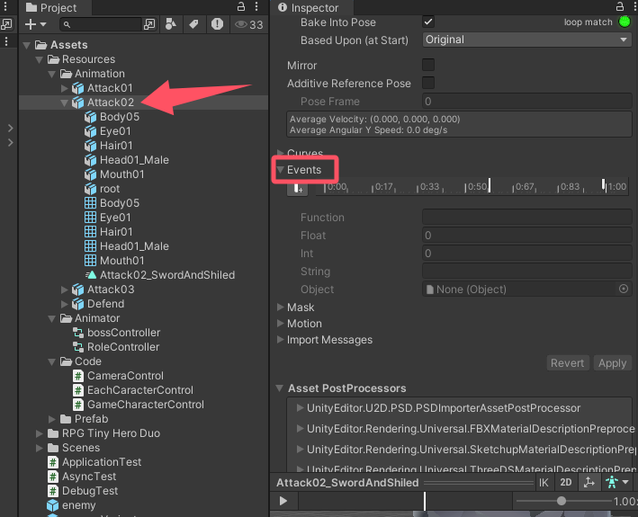
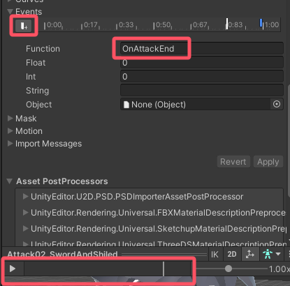

# 1.导入资源


# 2.各种总结

## 2.1.目录

`Assets`下必须有一个`Resources`目录

加载游戏物体函数`GameObject prefabFromResources = Resources.Load<GameObject>();`传入的路径以`Assets/Resources`为根目录

## 2.2.tag

我创建游戏物体后，想要为它设置tag  

```C#
GameObject leftCharacter = Instantiate(prefabFromResources, new Vector3(13, 0, z), Quaternion.Euler(rotate));
leftCharacter.tag = "leftCharacterTag";
```

会报错 `leftCharacterTag is not defined`，这是因为需要在unity中提前定义tag字段。，方法如下：

依次点击`Edit -> Project Settings -> Tags and Layers`，在这个页面可以设置。 

## 2.3.动画播放到某一帧时执行函数

点开一个动作，在右边往下滑找到`Events`



左右滑动下方的时间条，停在自己想停留的位置 然后点击左边的+，输入函数名即可



这个函数名对应哪个脚本里的函数暂时不清楚，**但是我猜测**，是使用该动画的角色物体绑定的脚本中的函数

# 2.4.调用游戏物体身上绑定的脚本中的函数

还是写一下获取游戏对象，这里通过`tag`获取

```C#
GameObject[] enemys = GameObject.FindGameObjectsWithTag(targetTag);
```

调用脚本中的函数

```C#
GameObject nearestEnemy;
//...省略一些对nearestEnemy的赋值
ScriptName targetScript = nearestEnemy.GetComponent<ScriptName>();
targetScript.PublicFuntion();
// ScriptName是nearestEnemy身上绑定的脚本的名字
// PublicFuntion是脚本中的一个public函数
```


# x.参考

[角色动画使用](https://www.bilibili.com/video/BV1gQ4y1e7SS?spm_id_from=333.788.videopod.episodes&vd_source=8924ad59b4f62224f165e16aa3d04f00&p=48)

